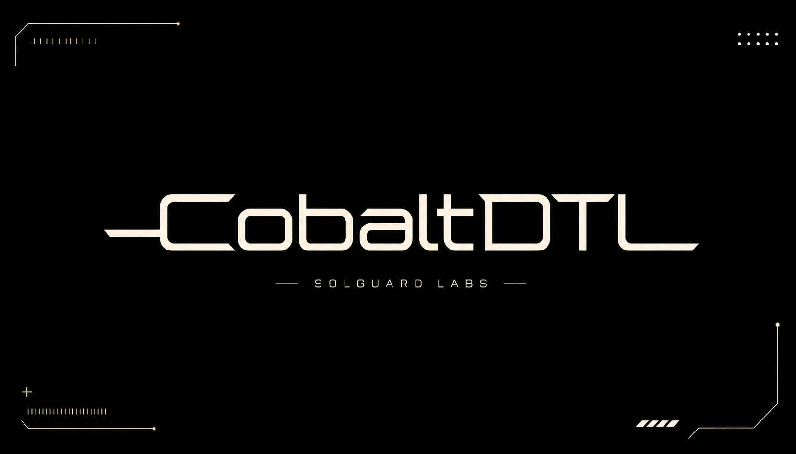
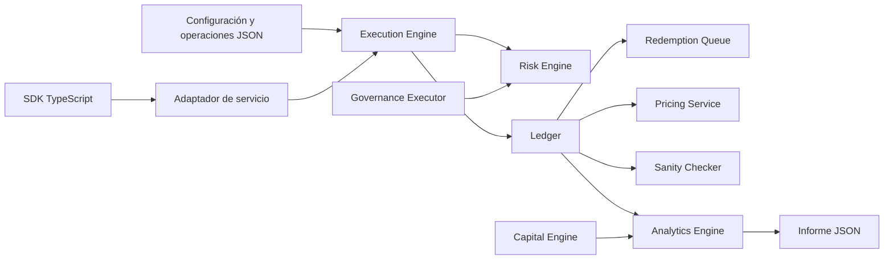
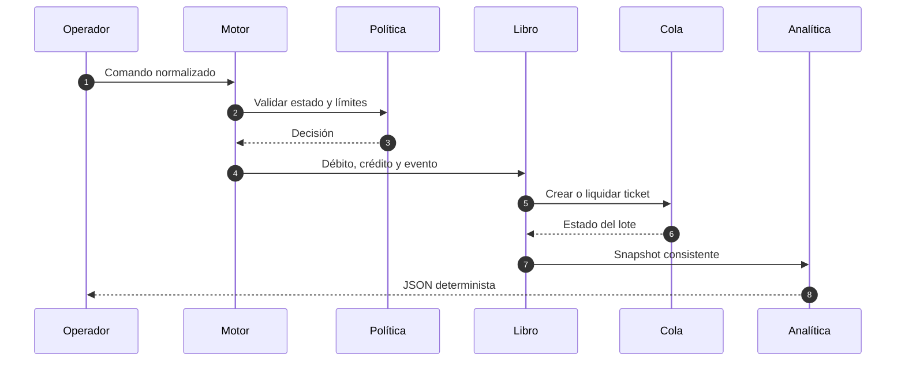
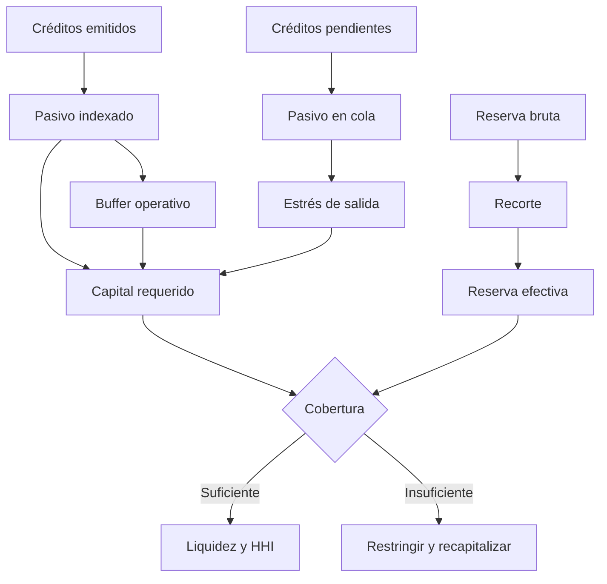

# CobaltDTL



[](https://github.com/SolguardLabs/CobaltDTL/actions/workflows/ci.yml)
[](https://github.com/SolguardLabs/CobaltDTL/actions/workflows/release-integrity.yml)
[](https://isocpp.org/)
[](https://nodejs.org/)

CobaltDTL es un motor de reservas sintéticas, créditos internos y redenciones diferidas. El núcleo C++ mantiene el libro por activo y vault, aplica políticas operativas, liquida tickets por lotes y emite un informe JSON determinista. El SDK TypeScript aporta integración segura y paridad de los cálculos de capital con cantidades `bigint`.

## Capacidades

- depósitos, emisión y transferencia de créditos;
- tickets con época de desbloqueo, pago mínimo y límite por lote;
- liquidaciones, rebalanceos, fondos de seguro y comisiones;
- precio, pasivo indexado, ratio de reserva y exposiciones por cuenta;
- capital bajo recortes, estrés de salidas, costes operativos y vencimientos;
- concentración de cartera mediante HHI y mayor cuota;
- gobernanza con SHA-256, quórum, espera, caducidad, predecesor y guardián;
- CLI portable, fixtures JSON, pruebas nativas y cliente TypeScript.

## Arquitectura



El libro es la fuente de verdad de reservas, créditos, tickets y eventos. Pricing calcula snapshots de valor; Risk decide admisión; Queue ordena vencimientos; Checks reconcilia cantidades; Analytics construye vistas operativas. Capital y Gobernanza son módulos puros, independientes del transporte.



## Modelo económico

El pasivo de un vault es:

\[
L=\left\lceil\frac{credits_{issued}\cdot index}{10^6}\right\rceil
\]

La reserva efectiva y las salidas estresadas son:

\[
R^{ef}=\left\lfloor R\frac{10.000-h}{10.000}\right\rfloor
\]

\[
O^{stress}=\left\lceil\frac{credits_{pending}\cdot index}{10^6}\right\rceil
\frac{10.000+s}{10.000}
\]

El capital requerido suma pasivo, salidas estresadas y buffer operativo. La conformidad exige déficit cero, cobertura y liquidez mínimas, además de un HHI bajo el máximo de política.



Consulte [Modelo económico](./docs/02-modelo-economico.md) para redondeos, vectores y escalera de respuesta.

## Inicio rápido

Requisitos:

- compilador C++17 (`cl`, `g++`, `clang++` o `c++`);
- Node.js 24 y npm.

```bash
npm ci
npm run ci
```

El script descubre Visual Studio 2022/18 Build Tools en Windows y toolchains GNU/Clang en Unix.

```bash
node scripts/build.mjs --warnings
out/cobaltdtl validate tests/fixtures/base_cycle.json
out/cobaltdtl run tests/fixtures/base_cycle.json --json --events
```

En Windows use `out/cobaltdtl.exe`.

### SDK TypeScript

```ts
import { CobaltClient } from "./sdk/cobaltClient.ts";

const client = new CobaltClient("https://vaults.example/api");
const capital = await client.capital();

await client.requestRedemption(
  {
    account: "treasury-eu",
    vault: "cvUSD",
    credits: 25_000n,
    minPayout: 24_500n,
    reference: "redeem-2026-08-001",
  },
  "idem-redeem-2026-08-001",
);
```

El cliente exige HTTPS fuera del bucle local, desactiva redirecciones, limita la respuesta y serializa importes como cadenas decimales.

## Validación

`npm run ci` ejecuta:

1. formato de JSON, Markdown, scripts y TypeScript;
2. comprobación TypeScript estricta;
3. pruebas C++ compiladas con warnings como errores;
4. build completo C++17;
5. pruebas de integración mediante CLI;
6. contrato de documentación, identidad visual y terminología pública.

GitHub Actions repite el proceso en Ubuntu y Windows. La rama `production`, la etiqueta anotada `v1.0.0` y el release deben resolver al mismo commit que `main`.

## Documentación

- [Arquitectura](./docs/01-arquitectura.md)
- [Modelo económico](./docs/02-modelo-economico.md)
- [Seguridad operativa](./docs/03-seguridad-operativa.md)
- [CLI, JSON y SDK](./docs/04-cli-json-sdk.md)
- [Operación y recuperación](./docs/05-operacion.md)
- [Gobernanza](./docs/06-gobernanza.md)
- [Observabilidad y conciliación](./docs/07-observabilidad.md)

## Versionado

Se usa SemVer. `v1.0.0` estabiliza el modelo de estado, la salida JSON, las fórmulas de capital y el SDK. Cualquier cambio incompatible de unidad, redondeo o campo requiere versión mayor y plan de migración.

La comunicación privada y la respuesta operativa se describen en [SECURITY.md](./SECURITY.md). El código se distribuye bajo [LICENSE](./LICENSE).
