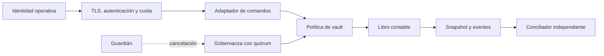
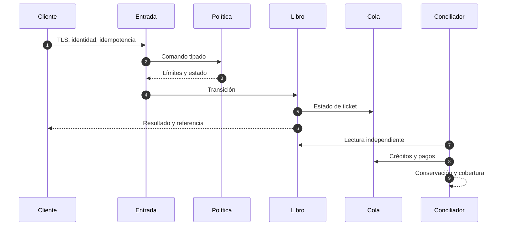

# Política de seguridad

CobaltDTL representa reservas, pasivos y derechos de redención. Su seguridad depende de conservar cantidades por activo, aplicar una política única a toda transición y reconciliar tickets, créditos y reservas desde una fuente independiente.

## Versiones mantenidas

| Versión   | Estado       | Actualizaciones |
| --------- | ------------ | --------------- |
| `1.x`     | Mantenida    | Sí              |
| `< 1.0.0` | No mantenida | No              |

## Límites de confianza

El borde autentica y limita tráfico. El motor vuelve a validar esquema, referencias, cantidades y política. La conciliación usa credenciales de solo lectura diferentes de las identidades que escriben.

## Propiedades críticas

- créditos en cuentas más créditos en tickets abiertos igualan créditos emitidos;
- reservas, comisiones y fondos de seguro no se vuelven negativos;
- un ticket terminal no puede liquidarse otra vez;
- cada operación produce un evento ordenado;
- cantidades e índices son enteros con escala declarada;
- el hash de gobernanza liga protocolo, red, destino, método, carga, predecesor, sal y época;
- el informe es determinista para el mismo estado.

## Defensa en profundidad

## Controles de despliegue

1. Compilar C++ con warnings como errores en Ubuntu y Windows.
2. Instalar dependencias con `npm ci` y el archivo de bloqueo.
3. Exigir revisión de propietarios para pricing, ledger, capital, gobernanza y workflows.
4. Promover solo un commit aprobado e idéntico en `main`, `production` y etiqueta anotada.
5. Comparar digest del artefacto y configuración efectiva antes de tráfico.
6. Mantener secretos fuera del repositorio y usar identidades de corta duración.

## Comunicación privada

Use **Security → Report a security advisory** en GitHub. Incluya versión, commit, precondiciones, secuencia mínima con datos sintéticos, propiedad económica afectada, impacto máximo y mitigación propuesta. No publique credenciales, datos personales ni detalles operativos de terceros.

| Fase                    |                 Objetivo |
| ----------------------- | -----------------------: |
| Acuse                   |        2 días laborables |
| Clasificación inicial   |        5 días laborables |
| Plan de contención alta |        7 días laborables |
| Actualización           | Cada 7 días hasta cierre |

## Respuesta

Ante una diferencia material se cierra escritura, se preservan snapshot y eventos, se aíslan los vaults afectados y se comparan reservas, créditos y tickets por secuencia. La reapertura exige restauración reproducible, conciliación conforme y aprobación separada. Consulte [Operación y recuperación](./docs/05-operacion.md).
