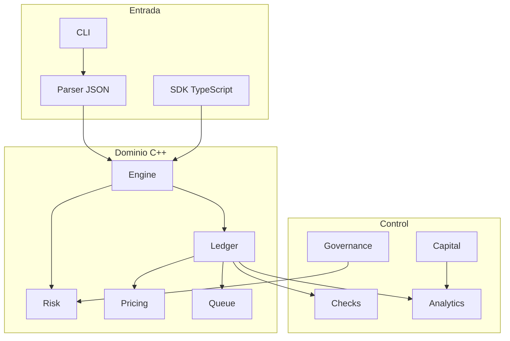
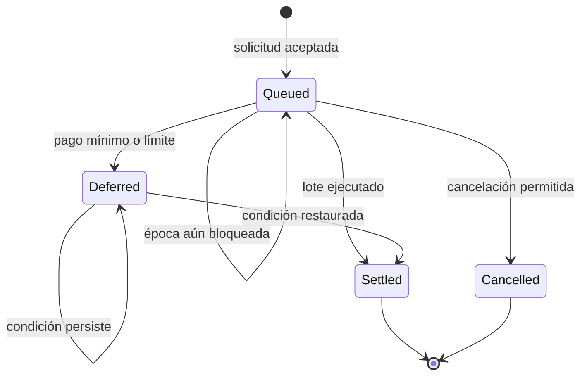

# Arquitectura

## Objetivo

CobaltDTL divide entrada, decisión de riesgo, mutación contable y análisis. Cada capa expone tipos explícitos y evita que el transporte decida reglas económicas.

## Componentes

| Componente   | Responsabilidad                                  | No debe hacer               |
| ------------ | ------------------------------------------------ | --------------------------- |
| `common`     | cantidades, errores, redondeos e identificadores | conocer vaults              |
| `model`      | entidades y esquema de configuración             | ejecutar operaciones        |
| `pricing`    | snapshot de precio y pasivo indexado             | mutar saldos                |
| `risk`       | admisión y estado operativo                      | emitir recibos              |
| `ledger`     | transiciones y eventos                           | autenticar transporte       |
| `queue`      | orden y elegibilidad temporal                    | fijar política global       |
| `capital`    | estrés y concentración                           | modificar el libro          |
| `governance` | identidad, quórum y tiempo                       | ejecutar sin aprobación     |
| `analytics`  | vistas y conciliación                            | autorizar operaciones       |
| `report`     | contrato JSON estable                            | recalcular reglas distintas |

## Estado de ticket

Un ticket terminal conserva identificador, créditos, precio de liquidación, pago y comisión. La integración persistente debe garantizar que el cambio de ticket y el asiento de reserva sean atómicos.

## Concurrencia

El motor local ejecuta una secuencia. Un servicio concurrente añade versión a vault, cuenta y ticket. La transacción de liquidación compara esas versiones, consume el presupuesto del lote, actualiza reserva y créditos, y escribe el evento. Un conflicto obliga a releer; nunca se recalcula sobre un estado parcialmente confirmado.

## Extensión

- Un activo nuevo declara decimales, recorte y unidad de reserva.
- Un movimiento nuevo añade operación, validación, evento y reconciliación.
- Un campo monetario nuevo usa `Amount` y prueba sus límites.
- Un parámetro de capital se refleja en modelo, parser, reporte, SDK y documentación.
- Una ruta externa requiere autenticación e idempotencia fuera del núcleo.
