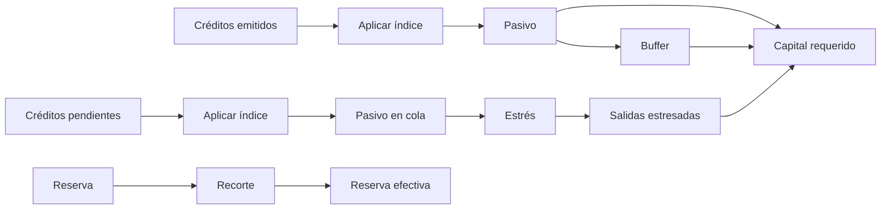
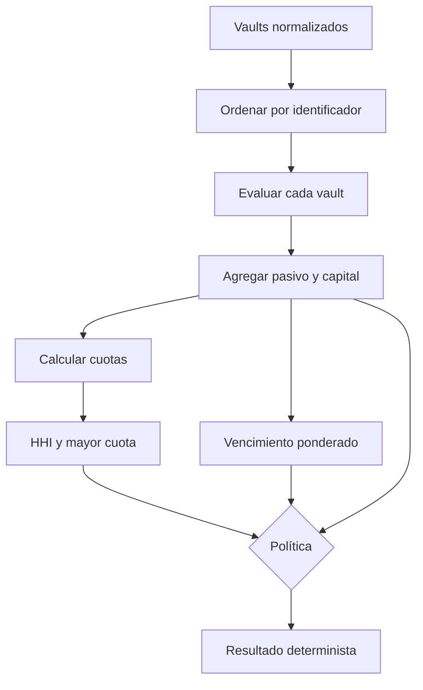

# Modelo económico

## Unidades

Las reservas y créditos son enteros en su unidad mínima. El índice usa escala `1.000.000`; los porcentajes usan `10.000 BPS`. No se admiten valores de coma flotante en decisiones.

## Precio y pasivo

El snapshot presenta reserva, créditos emitidos, créditos pendientes, suministro activo, precio y pasivo indexado. El pasivo económico es:

\[
L=\left\lceil credits_{issued}\cdot index/10^6\right\rceil
\]

El cálculo de capital siempre usa los créditos emitidos completos. Las vistas de precio y las vistas regulatorias son superficies distintas y deben explicarse por separado.

## Fórmulas de capital

\[
R^{ef}=\lfloor R(10.000-h)/10.000\rfloor
\]

\[
O^{stress}=\lceil L_q(10.000+s)/10.000\rceil
\]

\[
C=L+O^{stress}+\lceil Lc/10.000\rceil
\]

\[
D=\max(0,C-R^{ef})
\]

Los activos disponibles se redondean hacia abajo; obligaciones y buffers, hacia arriba. Cobertura y liquidez se informan hacia abajo.

## Cartera

Para cuota \(w_i=L_i/\sum L\):

\[
HHI=10.000\sum_i w_i^2
\]

El vencimiento ponderado usa el pasivo de cada vault. La cartera es conforme solo con déficit total cero, cobertura y liquidez mínimas y HHI no superior al máximo.

## Ejemplo

Un vault con reserva `900`, pasivo `1.000`, cola `100`, recorte `10 %`, estrés `50 %`, buffer `1 %` y liquidez `50` produce:

- reserva efectiva `810`;
- salidas estresadas `150`;
- buffer `10`;
- capital requerido `1.160`;
- déficit `350`;
- cobertura `6.982 BPS`;
- liquidez `3.333 BPS`.

## Vectores obligatorios

- cola cero y liquidez positiva;
- recorte de `10.000 BPS`;
- producto intermedio grande;
- redondeo superior con residuo;
- vaults duplicados;
- liquidez superior a reserva;
- HHI de carteras `100/0`, `60/40` y `50/50`;
- vencimiento cero y vencimiento ponderado.
