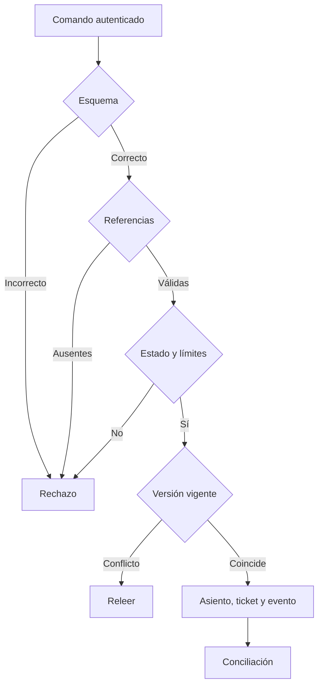
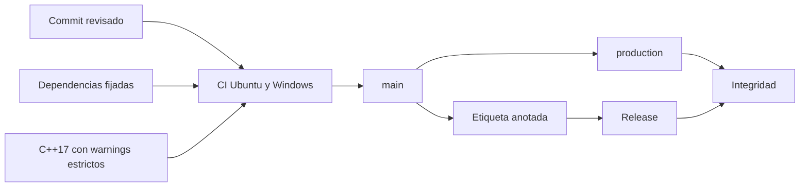

# Seguridad operativa

## Separación de funciones

| Función      |   Solicita | Aprueba |        Ejecuta | Concilia | Cancela |
| ------------ | ---------: | ------: | -------------: | -------: | ------: |
| Operaciones  |         Sí |      No | Según política |       No |      No |
| Gobernador   |         Sí |      Sí |    Tras espera |       No |      No |
| Conciliación |         No |      No |             No |       Sí |      No |
| Guardián     |         No |      No |             No |  Lectura |      Sí |
| Plataforma   | Despliegue |      No |             No | Métricas |      No |

## Controles

- TLS y credenciales efímeras en el borde.
- Lista de métodos y destinos explícita.
- Cuerpo, timeout y cuota limitados.
- Idempotencia ligada al hash canónico del comando.
- Reloj de épocas monotónico.
- Escritura cerrada si no puede verificarse estado o versión.
- Diario y copias con acceso de solo lectura independiente.

## Cadena de suministro

Los workflows usan permisos de lectura. Un permiso adicional requiere revisión de propietario y alcance mínimo.

## Incidente

Preservar snapshot y eventos, cerrar operaciones afectadas, reconciliar por activo y vault, identificar la primera secuencia divergente y recuperar mediante asientos explícitos. Nunca se edita un evento histórico. La reapertura requiere dos ventanas conformes.

## Datos

Los identificadores son referencias técnicas. Datos de entidad o persona se mantienen fuera del núcleo, cifrados y con retención independiente. Los fixtures versionados contienen datos sintéticos.
