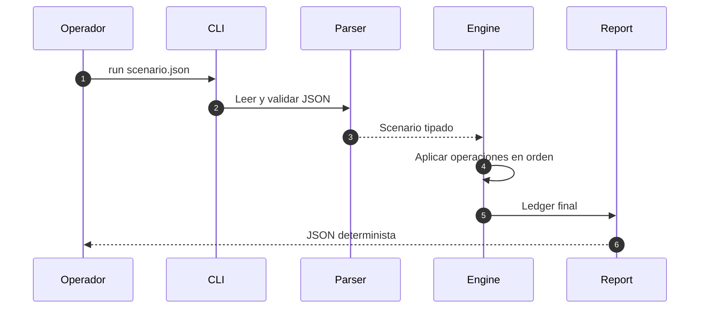
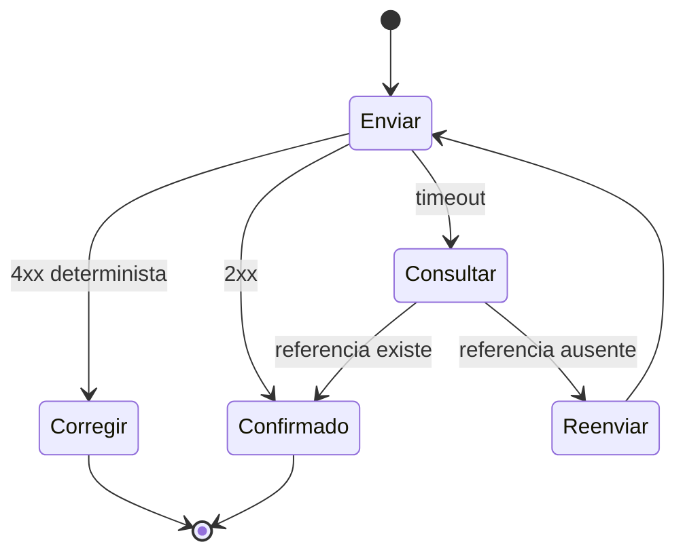

# CLI, JSON y SDK

## Comandos

```bash
out/cobaltdtl validate scenario.json
out/cobaltdtl run scenario.json --json
out/cobaltdtl run scenario.json --json --events --pretty
```

`validate` comprueba esquema y referencias. `run` ejecuta la secuencia completa y genera el estado final. `--events` añade el diario; `--pretty` cambia presentación, no contenido.



## Contrato JSON

La raíz incluye `name`, `epoch`, `assets`, `vaults`, `accounts`, `tickets`, `liquidations`, `metrics`, `reconciliation` y `analytics`. Los importes son enteros. Los consumidores toleran campos adicionales y rechazan cambios de unidad.

## SDK

```ts
import { CobaltClient, computeCapitalMetrics } from "../sdk/cobaltClient.ts";

const preview = computeCapitalMetrics({
  reserve: 1_250_000n,
  liquidReserve: 300_000n,
  issuedCredits: 1_000_000n,
  pendingCredits: 80_000n,
  index: 1_020_000n,
  reserveHaircutBps: 200n,
  redemptionShockBps: 2_500n,
  operationalBufferBps: 50n,
});
```

El SDK usa `bigint`; los comandos HTTP convierten importes a cadenas decimales y ordenan las claves antes del hash.



No se reintenta un comando sin idempotencia. La misma clave con cuerpo distinto es conflicto.

## Compatibilidad

Añadir un campo opcional es compatible. Eliminar, renombrar o cambiar unidad exige versión mayor. Cambiar un redondeo es incompatible aunque el tipo permanezca igual.
