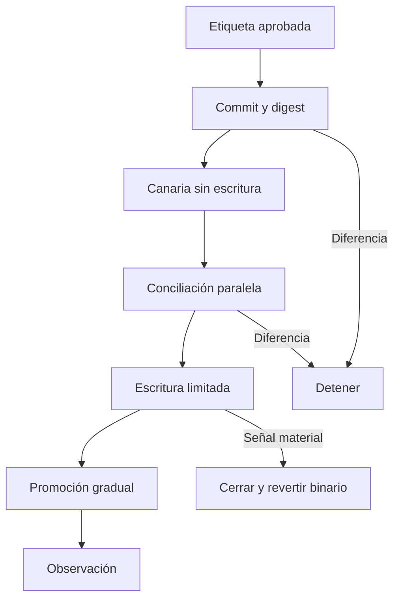
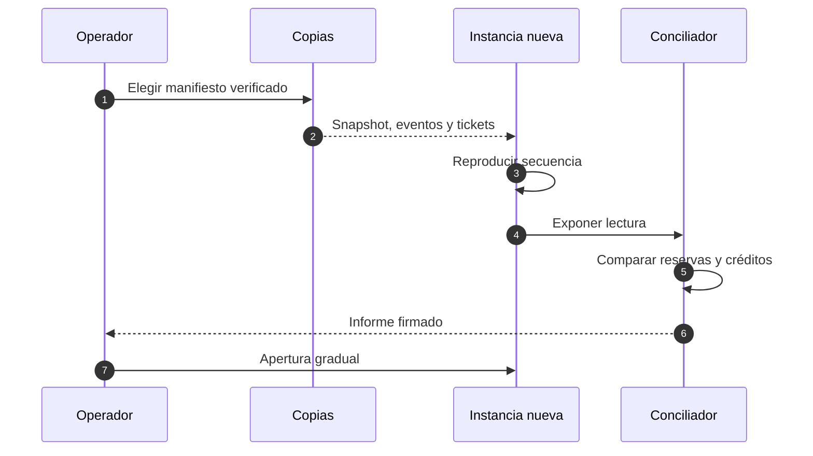

# Operación y recuperación

## Objetivos

| Indicador             |        Objetivo |
| --------------------- | --------------: |
| Lectura disponible    |         99,95 % |
| Escritura disponible  |         99,90 % |
| p95 de comando        |        < 750 ms |
| Conciliación conforme | 100 % por época |
| Retraso de diario     |      < 2 épocas |

La conservación prevalece sobre disponibilidad. Si falta versión o conciliación, se mantiene lectura y se cierra escritura.

## Copias

Conservar snapshot, eventos posteriores, tickets, idempotencias, configuración y manifiesto de hashes. La frecuencia debe limitar la pérdida de datos al objetivo acordado.

## Intervenciones

### Diferencia de reserva

Cerrar salidas del activo, preservar fuentes, distinguir valoración de cantidad, localizar primera secuencia y corregir con asiento compensatorio aprobado.

### Lote detenido

Agrupar tickets por estado y época, revisar pago mínimo, límite, liquidez y versión. No recrear tickets con otro identificador.

### Presión de capital

Congelar expansión, revisar recortes y salidas, recapitalizar por segregación y mantener dos ventanas conformes antes de restaurar cuotas.

## Mantenimiento

- semanal: colas, espacio, identidades y dependencias;
- mensual: restauración completa;
- trimestral: cancelación de guardián y pérdida de zona;
- por versión: migración, reversión y comparación de contratos JSON.
