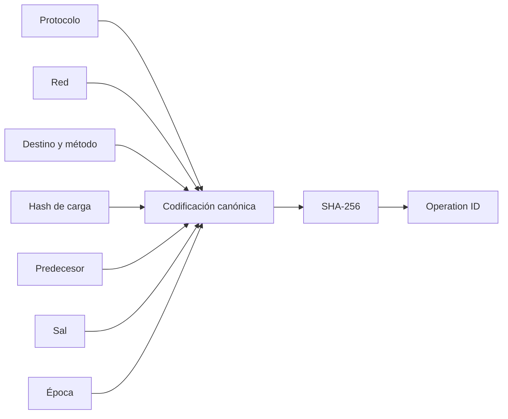
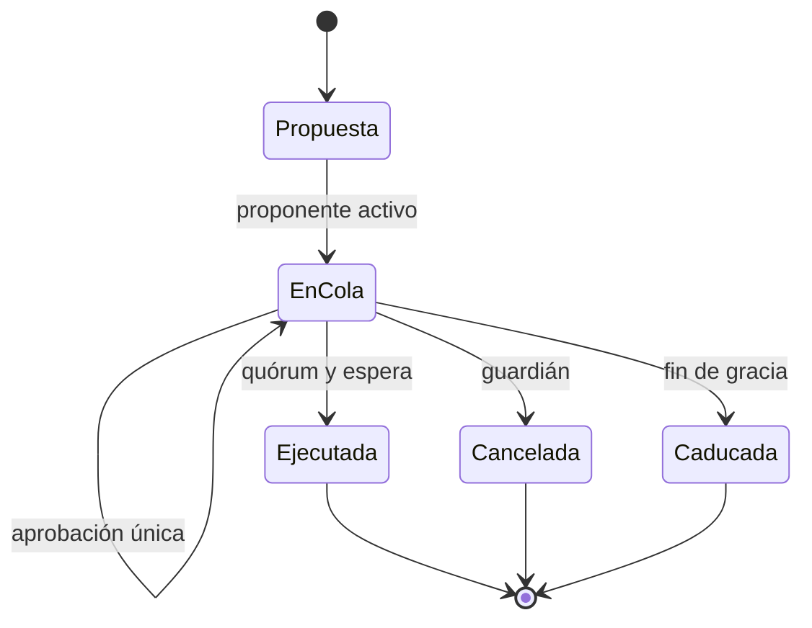

# Gobernanza

## Identidad

Cada operación liga protocolo, red, destino, método, hash de carga, predecesor, sal y época. Las cadenas se codifican con longitud antes de aplicar SHA-256, evitando ambigüedad por concatenación.

## Ciclo de vida

El proponente aporta la primera aprobación. Una identidad no aprueba dos veces. La ejecución exige época válida y predecesor ejecutado.

## Clases

| Cambio                    |   Quórum |    Espera | Revisión    |
| ------------------------- | -------: | --------: | ----------- |
| Operativo reversible      |      2/3 | 24 épocas | Operaciones |
| Parámetro económico       |      3/5 | 72 épocas | Riesgo      |
| Identidad o destino       |      4/5 | 96 épocas | Seguridad   |
| Restricción de emergencia | Guardián | Inmediata | Posterior   |

El guardián cancela o restringe; no amplía límites ni mueve reservas.

## Expediente

Toda propuesta contiene valor actual, valor nuevo, unidad, rango, simulación, impacto por vault, hash canónico, predecesores, observación y reversión. Cambios de binario, identidad, destino y parámetro económico se separan.
