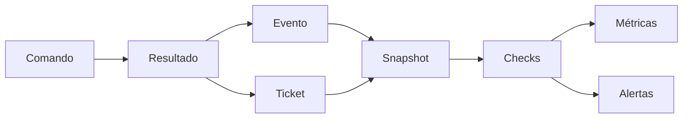
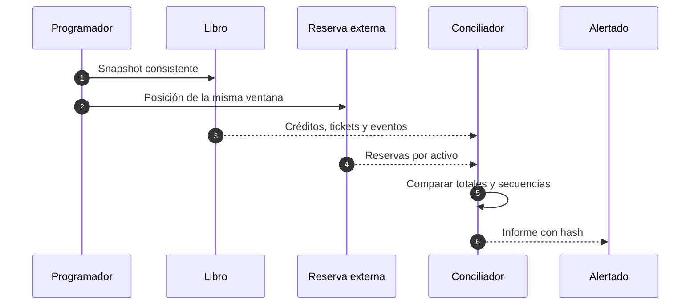

# Observabilidad y conciliación

## Evidencia

Cada registro incluye correlación, referencia, actor técnico, tipo, vault, activo, cantidad, decisión, razón, ticket, época y versión. No se registran credenciales ni cuerpos completos.

## Métricas

- comandos por tipo y estado;
- latencia p50, p95 y p99;
- rechazos por razón;
- tickets por estado y antigüedad;
- reserva, pasivo, déficit, cobertura y liquidez;
- HHI, mayor concentración y vencimiento;
- consumo de límites y pagos por lote;
- retraso del diario y del conciliador.

## Alertas

| Nivel       | Condición                         | Respuesta        |
| ----------- | --------------------------------- | ---------------- |
| Informativa | exceso o cambio previsto          | registrar        |
| Advertencia | retraso o cola envejecida         | revisar          |
| Alta        | política o concentración anómala  | limitar circuito |
| Crítica     | déficit o conservación incumplida | cerrar escritura |

Una segregación con déficit activa alerta crítica aunque el agregado parezca suficiente.

## Panel

Mostrar versión, estado de escritura, última conciliación, reservas y pasivos por activo, vaults ordenados por déficit, tickets por edad, límites consumidos y cambios de gobernanza pendientes.

## Retención

Los eventos, tickets, referencias y aprobaciones se conservan con integridad verificable. Las métricas agregadas pueden compactarse; la evidencia contable no se sobrescribe.
